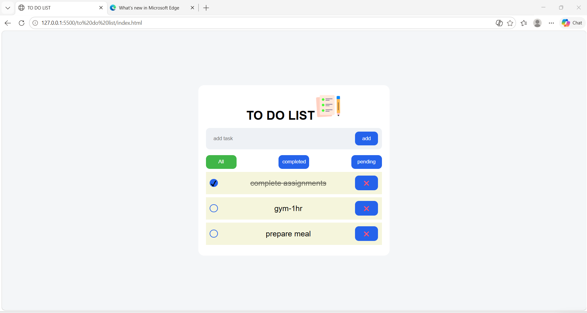

# Todo List App

A simple Todo List application built using HTML, CSS and JavaScript.

## Features
- Add tasks
- Delete tasks
- Mark tasks as completed
- Filter completed and pending tasks
- Local storage support
- Responsive user interface

  ## Screenshot

## Technologies Used
- HTML
- CSS
- JavaScript

## Author
Arudhra
